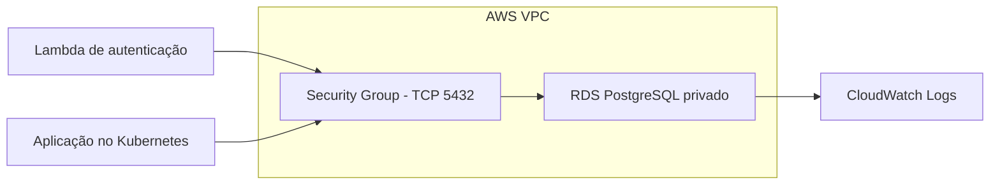

# Mecanica - Database Infrastructure

Infraestrutura como código responsável pelo banco de dados PostgreSQL
gerenciado do sistema de ordens de serviço da oficina mecânica.

## Responsabilidades

- provisionar uma instância PostgreSQL no Amazon RDS;
- manter o banco sem acesso público;
- restringir a porta `5432` às cargas executadas dentro da VPC;
- habilitar criptografia de armazenamento, backups e logs;
- fornecer os endereços consumidos pela aplicação e pela Lambda de
  autenticação;
- validar todas as alterações Terraform no GitHub Actions.

## Tecnologias

- Terraform 1.15;
- AWS Provider 6;
- Amazon RDS for PostgreSQL 16;
- Amazon VPC e Security Groups;
- Amazon CloudWatch Logs;
- GitHub Actions.

## Arquitetura



O projeto reutiliza a VPC padrão do AWS Academy para reduzir custo e
complexidade no ambiente acadêmico. O RDS não recebe endereço público.

## Configuração atual

| Configuração | Homologação |
|---|---:|
| Engine | PostgreSQL 16.14 |
| Classe | `db.t4g.micro` |
| Armazenamento | 20 GiB `gp3` |
| Multi-AZ | Não |
| Backup | 1 dia |
| Criptografia | Habilitada |
| Acesso público | Desabilitado |

Produção utiliza sete dias de retenção de backup. A configuração Single-AZ é
uma decisão de economia para o Learner Lab e deve ser revista em um ambiente
corporativo real.

## Pré-requisitos

- Terraform instalado;
- AWS CLI instalada;
- sessão ativa no AWS Academy Learner Lab;
- credenciais temporárias configuradas em `~/.aws/credentials`.

Valide a sessão:

```bash
aws sts get-caller-identity
```

## Variáveis

| Variável | Obrigatória | Padrão |
|---|---:|---|
| `environment` | Sim | - |
| `database_password` | Sim | - |
| `aws_region` | Não | `us-east-1` |
| `database_name` | Não | `mecanica` |
| `database_username` | Não | `mecanica_admin` |
| `postgres_engine_version` | Não | `16.14` |
| `database_instance_class` | Não | `db.t4g.micro` |
| `allocated_storage_gib` | Não | `20` |

Nunca grave a senha real em arquivos versionados. Para execução local, use uma
variável de ambiente:

### PowerShell

```powershell
$env:TF_VAR_database_password = "senha-segura"
```

### Bash

```bash
export TF_VAR_database_password="senha-segura"
```

## Validação local

```bash
terraform -chdir=infra init
terraform -chdir=infra fmt -check
terraform -chdir=infra validate
terraform -chdir=infra plan -var="environment=homolog"
```

O comando `plan` não cria recursos. Ele apresenta as mudanças propostas para
revisão.

## Deploy

Depois de revisar o plano:

```bash
terraform -chdir=infra apply -var="environment=homolog"
```

Para remover os recursos e interromper a cobrança:

```bash
terraform -chdir=infra destroy -var="environment=homolog"
```

O deploy automatizado é executado pelo GitHub Actions:

- push em `homolog`: aplica o ambiente `homolog`;
- push em `main`: aplica o ambiente `production` com a variável `prod`.

Cada branch utiliza uma chave de state diferente no mesmo bucket S3.

## Outputs

Após o deploy, o Terraform fornece:

- identificador do RDS;
- endereço DNS privado;
- porta PostgreSQL;
- nome do banco;
- URL JDBC;
- security group do banco.

Os outputs não incluem a senha.

## CI/CD

O workflow de CI executa em pushes de features e pull requests destinados a
`homolog` ou `main`:

1. inicialização do Terraform sem backend;
2. verificação de formatação;
3. validação da configuração.

O workflow de CD executa após mudanças em `homolog` e `main`:

1. configura as credenciais temporárias da AWS;
2. inicializa o backend remoto no S3;
3. gera um plano Terraform;
4. aplica automaticamente o plano aprovado pelo fluxo de Pull Request.

Os ambientes `homolog` e `production` devem possuir estes secrets:

- `AWS_ACCESS_KEY_ID`;
- `AWS_SECRET_ACCESS_KEY`;
- `AWS_SESSION_TOKEN`;
- `TF_STATE_BUCKET`;
- `DATABASE_PASSWORD`.

As três credenciais AWS devem ser atualizadas sempre que a sessão temporária
do Learner Lab expirar.

A branch `main` é protegida e alterações devem ser promovidas por Pull Request.

## Swagger/Postman

Não se aplica a este repositório, pois ele não expõe endpoints HTTP. A
documentação Swagger pertence ao repositório da aplicação principal.

## Segurança e custos

- arquivos `*.tfvars`, states e configurações locais são ignorados pelo Git;
- o banco é privado e utiliza armazenamento criptografado;
- a classe e o armazenamento foram reduzidos para o orçamento acadêmico;
- o RDS gera cobrança enquanto estiver provisionado;
- destrua o ambiente quando não estiver sendo utilizado para demonstração.
